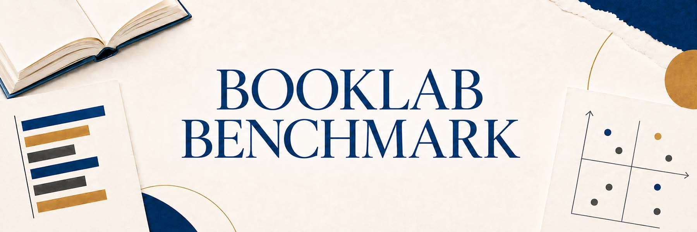
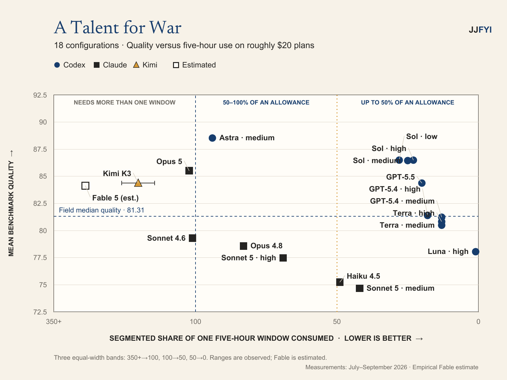
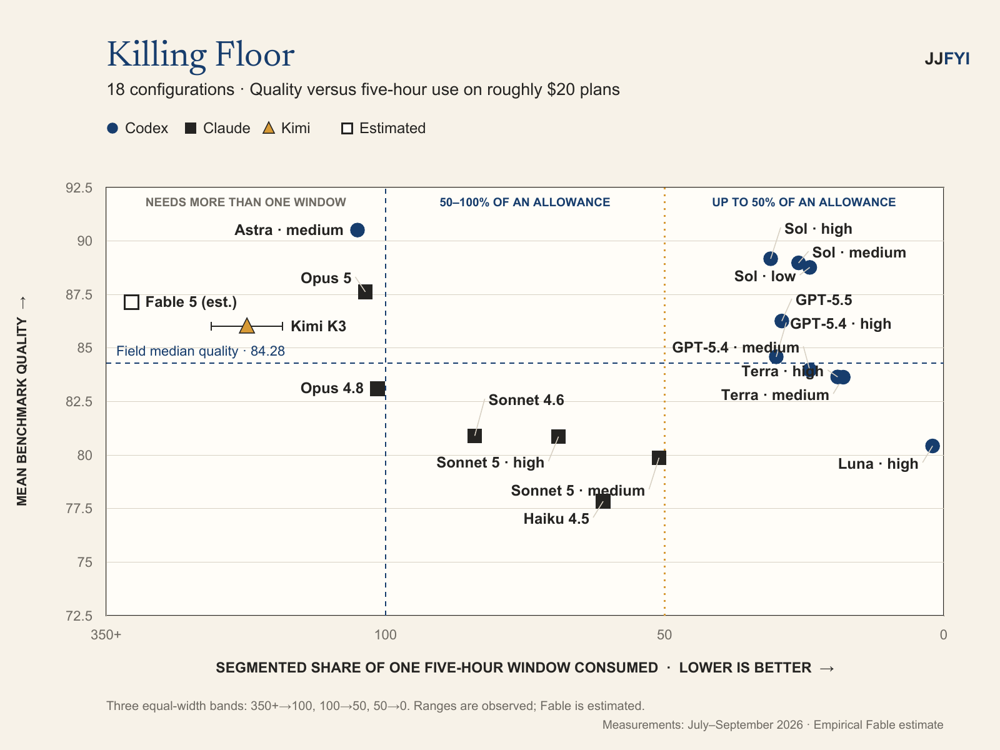
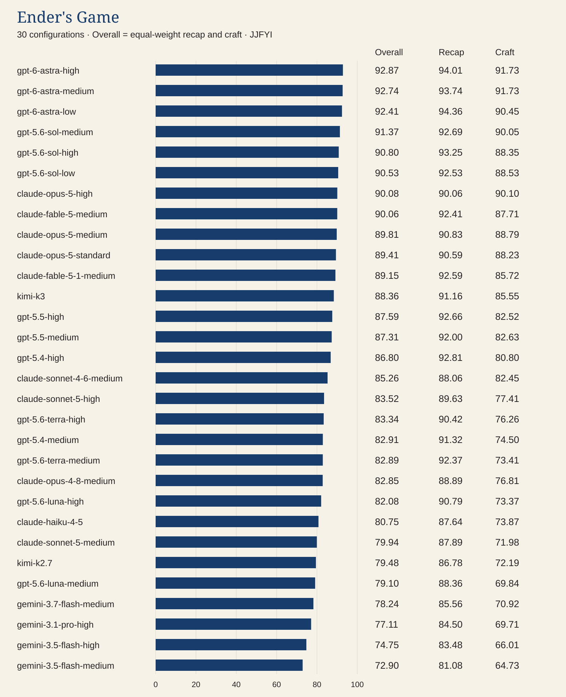
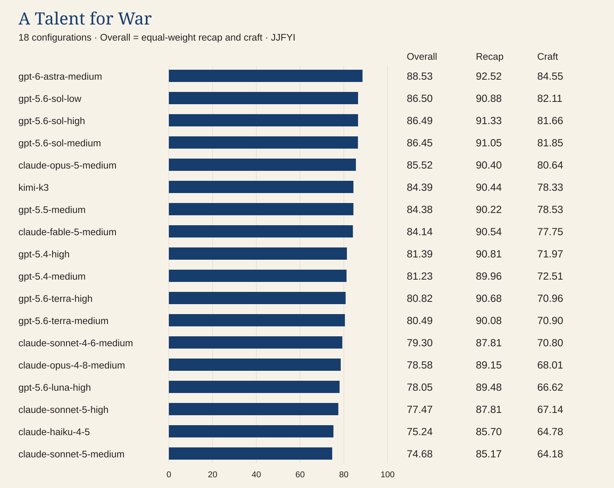
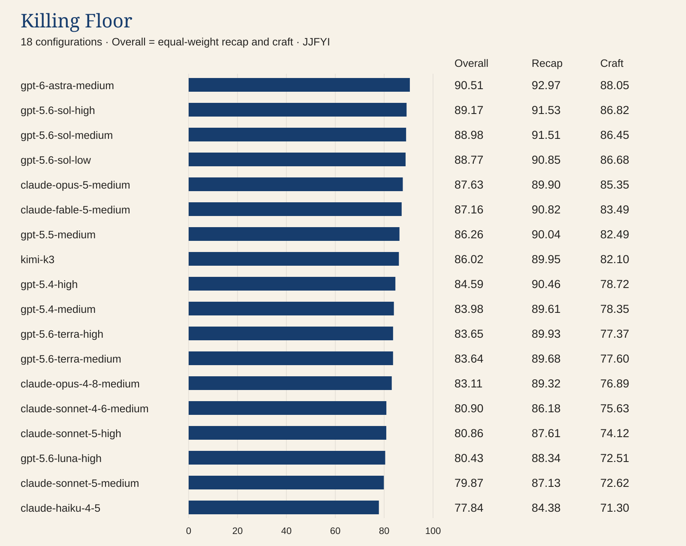

# Booklab Benchmark

A benchmark project from <a href="https://jjfyi.substack.com">JJFYI</a>.

[CC BY-NC 4.0](https://creativecommons.org/licenses/by-nc/4.0/) · [Attribution and commercial permissions](REUSE.md)

Creators and publishers may use the charts in monetized coverage of Booklab Benchmark with attribution. See the [additional editorial permission](REUSE.md#additional-permission-for-monetized-editorial-coverage).

## Which AI model makes sense for the work I pay for?

I built Booklab Benchmark to test AI on demanding knowledge work: analyzing fiction chapters well enough to help me remember a book and study how it works. I compare the quality of that analysis with its felt costs, especially how much of a subscription allowance it consumes.

You don't need to have read the articles to use these results. Start with the charts below, then open a suite for its full tables and supporting analysis.

### Read the series on JJFYI

- [Introduction: Booklab Benchmark and knowledge work](https://jjfyi.substack.com/p/booklab-benchmark-knowledge-work) explains the question and the test.
- [Part One: Flagship models](https://jjfyi.substack.com/p/booklab-benchmark-part-one-flagship-models) reports the initial four-chapter screen.
- **Part Two: What My Subscription Actually Buys** is in preparation. It compares both complete books and their subscription costs. The supporting results are available below; the article link will be added when it is published.

Results snapshot: **September 16, 2026**, using the final Part One evidence dated September 6 and the Part Two evidence dated September 16. These are dated observations, not claims about today's subscription limits.

## The key results: quality versus five-hour allowance

I'm leading with the comparison I found most useful. Astra scored highest on both complete books. Sol offered strong quality while using about a quarter of a five-hour allowance. Opus was close to Sol on quality but used more than a full allowance on the tested $20 plan.

**How to read it:** higher means better analysis; farther right means less allowance consumed. The horizontal scale is segmented, so read the percentages rather than comparing distances across bands. The quality guide is the field median, not a passing score. Ranges show observed use; Fable's hollow marker is an estimate. A value above 100% means the complete job consumed more than one fresh allowance across its segments, not that it took five hours to run.

The second book confirmed the main subscription result.

The charts use the same scales and keep the books separate. Different texts and reference keys make a single cross-book ranking less useful than asking whether the comparison holds within each book. Fable's estimated use is about 295% and 327%, based on the empirical Claude tier comparison, not a direct $20 measurement.

[ATFW chart data and interpretation](suites/atfw-full/quality-vs-five-hour.md) · [Killing Floor chart data and interpretation](suites/killing-floor-full/quality-vs-five-hour.md) · [Subscription tiers and weekly allowances](analysis/subscription-tiers.md)

## What was tested?

A configuration is a model at a particular effort setting. Each configuration was run more than once. Every chapter was analyzed independently, without memory of the other chapters. “Complete book” means repeating that chapter-analysis task across the book, not asking a model to synthesize the entire novel in one conversation.

| Suite | Scope | Configurations | Results |
|---|---|---|---|
| *Ender's Game* | 4 chapters | 30 | [Open suite](suites/enders-4ch/README.md) |
| *A Talent for War* | 27 chapters | 18 | [Open suite](suites/atfw-full/README.md) |
| *Killing Floor* | 34 chapters | 18 | [Open suite](suites/killing-floor-full/README.md) |

The quality score is the equal-weight mean of two deliberately chosen components: **recap**, for capturing what happened, and **craft**, for explaining how the writing works and why it matters. Each is scored on a 0–100 scale. The combined score supports an overall comparison; the component scores help when one aspect matters more to you.

## Quality across the three suites

These bars start at zero and show mean overall quality, with recap and craft printed alongside. Compare configurations within each chart. Small score differences are descriptive, not evidence of a statistically established winner.

### Ender's Game: the screen

The final screen includes later additions to the original field. It provided the starting hypotheses for the full-book tests. [Full standings and repeat-run scores](suites/enders-4ch/results.md).

### A Talent for War: all 27 chapters

Astra led quality; Sol's effort settings clustered closely. The recap/craft columns let you examine the kind of quality you need. [Full standings and repeat-run scores](suites/atfw-full/results.md).

### Killing Floor: all 34 chapters

The second full-book test lets you check which findings held up on a different text. [Full standings and repeat-run scores](suites/killing-floor-full/results.md).

## My choice based upon Booklab Benchmark

I would choose Codex, with Sol for important analysis and Luna high for routine recap. Astra is the option when its additional quality justifies its much heavier use of the allowance.

Within Claude Code, I would choose Opus 5 for quality and Sonnet 5 as the workhorse. But Opus consumed 111% and 118% of a five-hour allowance for these books on the tested $20 plan. That makes it impractical for the full-book work I want to finish within one allowance. Sonnet 5 high fits, but its craft scores were substantially lower.

On the tested $200 Claude plan, Opus used only 3% and 4% of the five-hour allowance. Either book fit comfortably, so the reset interruption would not be a reason for me to choose a different model on that plan.

That is my decision for this task, not a verdict on every kind of knowledge work.

## Explore the evidence

- [Methodology and limits](METHODOLOGY.md): what the scores and quota readings mean.
- [Subscription tiers](analysis/subscription-tiers.md): $20 versus $200, five-hour versus weekly, and the Fable estimate.
- [Consistency across the matched field](analysis/consistency.md): repeat-run ranges for the same 18 configurations.
- [Data definitions](data/README.md) and [change history](CHANGELOG.md): how to interpret and track the published results.

This is the maintained public results reference for Booklab Benchmark. Dated data files preserve the evidence behind the articles. Source chapters, private logs, and internal scoring artifacts are not distributed here.

## Reuse and attribution

Original copyrightable content is licensed under **Creative Commons Attribution–NonCommercial 4.0 International (CC BY-NC 4.0)**, with [additional permission for monetized editorial coverage](REUSE.md#additional-permission-for-monetized-editorial-coverage). Credit **Jeff Jones / JJFYI**, link to [this repository](https://github.com/jjfyi/booklab-benchmark) and the license, and identify modifications. Creators may earn platform revenue while discussing the benchmark and showing its charts. Paid advertising and sponsored product promotion using protected material require a separate agreement unless independently permitted by law. Standalone branding assets and third-party material are excluded; embedded branding may remain for source identification. See [reuse terms and preferred attribution](REUSE.md) and the [full license](LICENSE).
